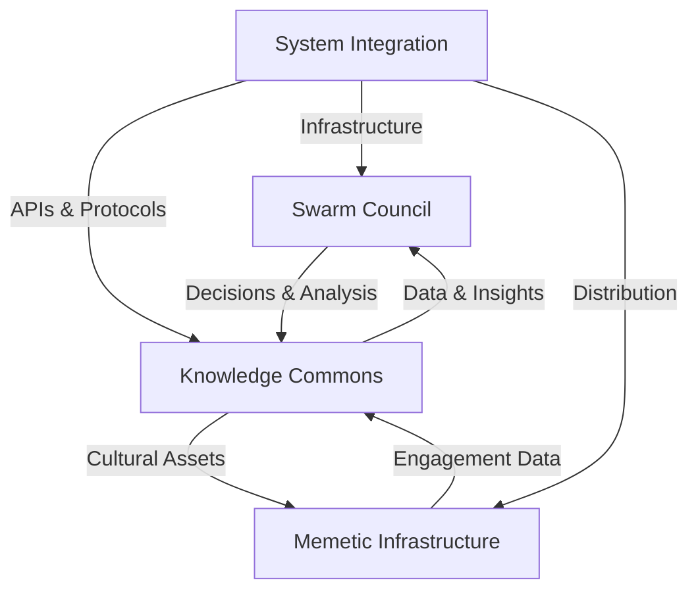

# Technical Architecture Overview

GAIA AI's technical architecture is built around a swarm of interoperable, specialized agents that work together to process information, make decisions, and catalyze regenerative action. This document provides an overview of the system's core components.

## System Components

## Core Components

### [Swarm Council of Agents](./swarm-council-of-agents)
- Interoperable, specialized agents
- Domain-specific expertise
- Collective intelligence system
- Trust-building mechanisms

### [Knowledge Commons](./Data-Architecture)
- Data processing pipeline
- Memory management
- Information synthesis
- Community access

### [Memetic Infrastructure](./memetic-infrastructure)
- Avatar network
- Content engine
- Distribution systems
- Engagement tracking

### [System Integration](./system-integration)
- API layer
- Security framework
- Scalability solutions
- Development standards

## Next Steps

Explore each component in detail:
- [Swarm Council of Agents](./swarm-council-of-agents)
- [Knowledge Commons](/docs/Technological-Architecture/Data-Architecture)
- [Memetic Infrastructure](./memetic-infrastructure)
- [System Integration](./system-integration)