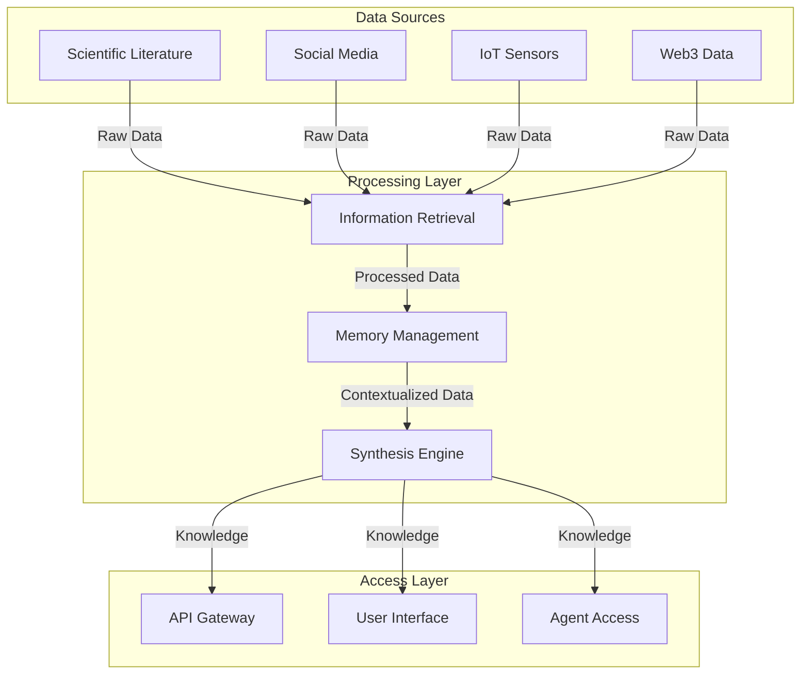

# Knowledge Commons and Data Architecture

The Knowledge Commons is GAIA AI's central nervous system, processing and synthesizing information from diverse sources to create a living repository of regenerative wisdom.

## Data Processing Pipeline

## Components

### Information Retrieval
- Scientific literature processing
- Technical documentation analysis
- Multimedia content processing
- Social interaction analysis
- Real-time data streams

### Memory Management
- Long-term knowledge storage
- Short-term context handling
- Cross-reference system
- Version control
- Cache management

### Synthesis Engine
- Pattern recognition
- Cross-domain analysis
- Knowledge integration
- Insight generation
- Verification systems

## Data Sources

### Scientific and Technical
- Academic papers
- Technical documentation
- Research databases
- Patent databases
- Environmental data

### Social and Cultural
- Social media feeds
- Community discussions
- Cultural artifacts
- News sources
- Multimedia content

### Sensor Networks
- IoT devices
- Environmental sensors
- Satellite data
- Weather stations
- Biodiversity monitors

### Web3 and Financial
- Blockchain data
- Smart contract events
- Market information
- Token metrics
- Impact certificates

## Data Quality and Governance

### Quality Assurance
- Data validation
- Source verification
- Accuracy checks
- Consistency monitoring
- Error detection

### Data Governance
- Access controls
- Privacy protection
- Ethics guidelines
- Compliance frameworks
- Data sovereignty

## Integration Patterns

### API Integration
- RESTful endpoints
- GraphQL interface
- WebSocket connections
- Event streams
- Batch processing

### Data Formats
- JSON/JSON-LD
- RDF/Semantic Web
- Binary formats
- Time-series data
- Geospatial data

## Community Access

### Interface Types
- Web platform
- Mobile apps
- API access
- Command-line tools
- Analytics dashboards

### Access Controls
- Role-based access
- API keys
- OAuth integration
- Rate limiting
- Usage monitoring

## Performance and Scalability

### Optimization
- Query optimization
- Cache strategies
- Load balancing
- Data partitioning
- Index management

### Infrastructure
- Distributed storage
- Processing clusters
- CDN integration
- Backup systems
- Disaster recovery