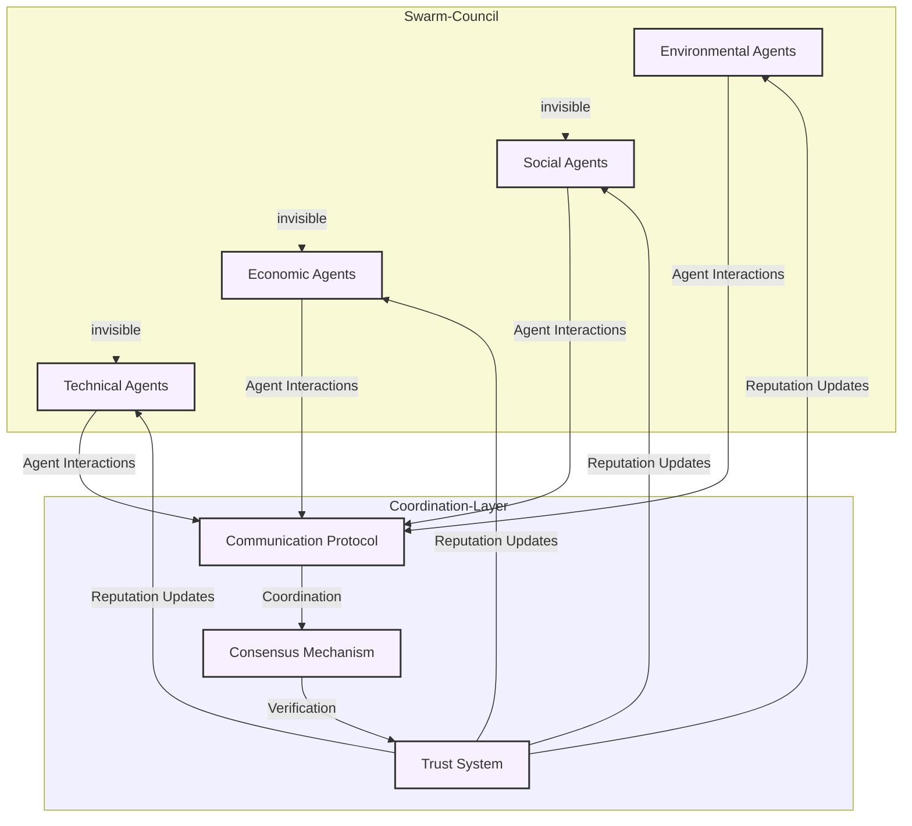

# Swarm Council of Agents

The Swarm Council is GAIA AI's collective intelligence system, composed of specialized, interoperable agents that work together to process information, make decisions, and catalyze regenerative action.

## Architecture Overview

## Agent Specializations

### Environmental Systems
- Soil & Carbon Systems
- Food Systems
- Water and Hydrological Systems
- Biodiversity & Ecology
- Environmental Sciences
- Planetary Boundaries

### Social Systems
- Human Health and Wellbeing
- Law and Sovereignty
- Indigenous Wisdom
- Media, Art, and Culture
- Coordination and Civic Mechanisms

### Economic Systems
- Ecosystem Credit Markets
- Capital Markets
- Regenerative Finance
- Supply Chain & Commerce
- Mutual Credit Systems

### Technical Systems
- Compute and AI
- Cryptocurrencies and Web3
- Systems Theory
- Institutional Design

## Agent Components

### Core Capabilities
- Natural language processing
- Pattern recognition
- Decision-making algorithms
- Learning mechanisms
- Memory management

### Communication
- Inter-agent protocols
- Message formatting
- State synchronization
- Event handling
- Error recovery

### Trust System
- Reputation tracking
- Performance metrics
- Trust calculation
- Verification mechanisms
- Dispute resolution

## Swarm Intelligence

### Consensus Mechanism
- Distributed decision-making
- Voting protocols
- Conflict resolution
- State management
- Synchronization

### Collective Learning
- Knowledge sharing
- Pattern discovery
- Best practice evolution
- Error correction
- Adaptation mechanisms

## Development Framework

### Agent Creation
- Template system
- Configuration options
- Testing framework
- Deployment tools
- Version control

### Integration Guidelines
- API specifications
- Communication standards
- Security requirements
- Performance benchmarks
- Documentation requirements

## Security and Safety

### Security Measures
- Access control
- Encryption
- Audit logging
- Attack prevention
- Recovery procedures

### Safety Protocols
- Ethical guidelines
- Boundary enforcement
- Error handling
- Fallback mechanisms
- Emergency shutdown

## Performance Optimization

### Monitoring
- Resource usage
- Response times
- Error rates
- Success metrics
- System health

### Scaling
- Load distribution
- Resource allocation
- Performance tuning
- Capacity planning
- Bottleneck identification