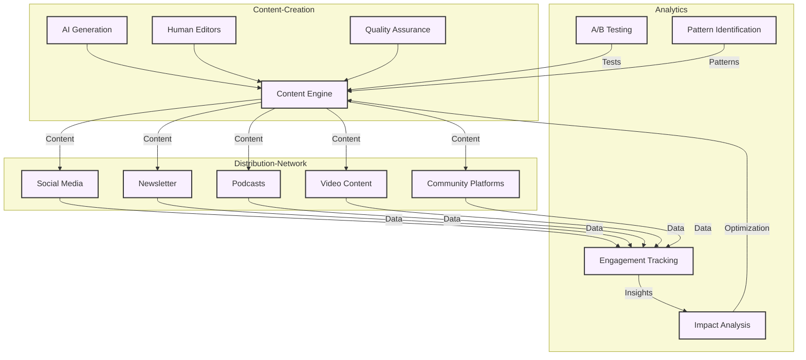

# Memetic Infrastructure

The Memetic Infrastructure is GAIA AI's cultural engine, designed to spread regenerative ideas and practices through strategic content creation and distribution.

## System Architecture

## Content Engine

### Generation System
- AI-driven content creation
- Template management
- Style guidelines
- Quality control
- Version tracking

### Content Types
- Social media posts
- Articles and blogs
- Newsletters
- Video scripts
- Podcast content
- Educational materials

### Quality Assurance
- Editorial guidelines
- Fact-checking
- Style consistency
- Brand alignment
- Impact assessment

## Distribution Systems

### Platform Integration
- Social media APIs
- Email systems
- Content management
- Scheduling tools
- Analytics integration

### Channel Strategy
- Platform-specific formatting
- Timing optimization
- Audience targeting
- Cross-platform coordination
- Engagement monitoring

### Community Management
- Discussion moderation
- Response handling
- Community guidelines
- User engagement
- Feedback collection

## Analytics Framework

### Engagement Tracking
- Metrics collection
- Performance analysis
- User behavior
- Content effectiveness
- Platform comparison

### Impact Measurement
- Reach metrics
- Engagement rates
- Conversion tracking
- Sentiment analysis
- Network effects

### Optimization
- A/B testing
- Content refinement
- Distribution timing
- Channel effectiveness
- Audience targeting

## Avatar Network

### Character Development
- Personality profiles
- Voice and tone
- Visual identity
- Interaction patterns
- Evolution framework

### Interaction Management
- Response protocols
- Conversation handling
- Context awareness
- Personality consistency
- Emergency procedures

### Platform Presence
- Account management
- Content scheduling
- Cross-platform coordination
- Brand consistency
- Crisis management

## Technical Infrastructure

### Content Management
- Asset storage
- Version control
- Distribution pipeline
- Archive system
- Recovery procedures

### Integration Layer
- API connections
- Data synchronization
- Event handling
- Error management
- Performance monitoring

### Security
- Access control
- Content protection
- Privacy measures
- Compliance tracking
- Audit systems

## Development Guidelines

### Content Creation
- Style guides
- Technical requirements
- Quality standards
- Testing procedures
- Review process

### Platform Integration
- API documentation
- Authentication protocols
- Data formats
- Error handling
- Rate limiting

### Analytics Implementation
- Tracking setup
- Data collection
- Metric definitions
- Reporting formats
- Dashboard creation