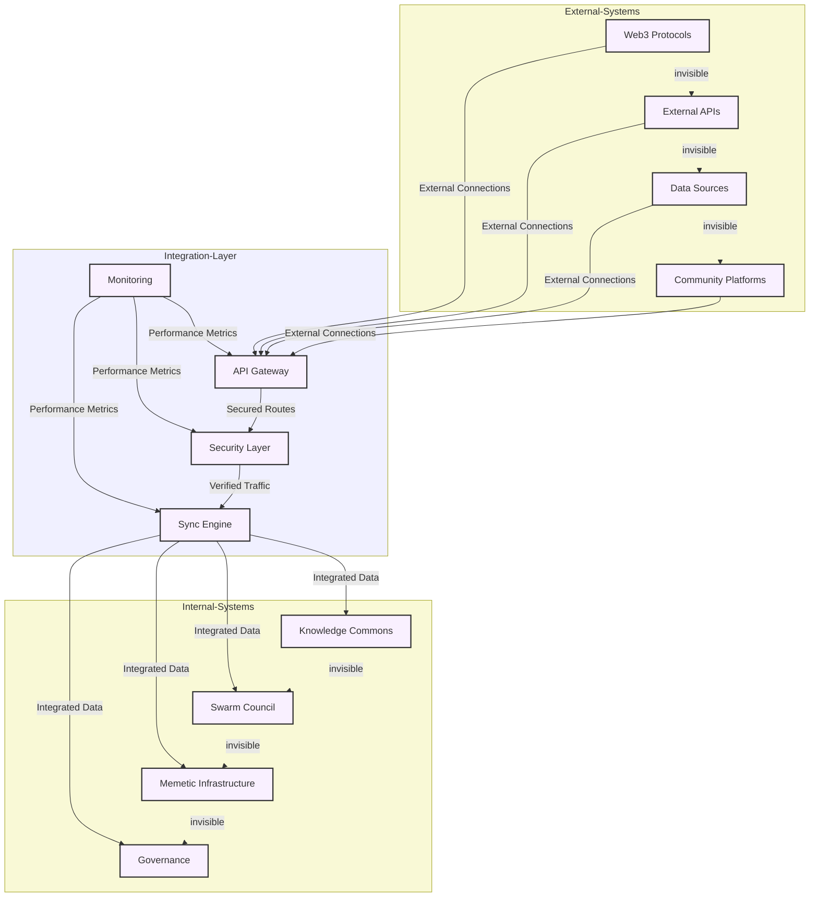

# System Integration

The System Integration layer provides the technical foundation that enables all components of GAIA AI to work together seamlessly while maintaining security, scalability, and reliability.

## Architecture Overview

## API Layer

### Gateway Architecture
- Route management
- Load balancing
- Rate limiting
- Caching
- Version control

### API Standards
- RESTful endpoints
- GraphQL interface
- WebSocket support
- Documentation
- Error handling

### Integration Patterns
- Synchronous operations
- Asynchronous processing
- Event-driven architecture
- Message queues
- Webhooks

## Security Framework

### Access Control
- Authentication
- Authorization
- Role management
- Token validation
- Session handling

### Data Protection
- Encryption
- Key management
- Privacy controls
- Data masking
- Audit logging

### Security Monitoring
- Threat detection
- Intrusion prevention
- Vulnerability scanning
- Security alerts
- Incident response

## Scalability Solutions

### Infrastructure
- Container orchestration
- Auto-scaling
- Load distribution
- Resource management
- Failover systems

### Performance
- Caching strategies
- Query optimization
- Connection pooling
- Resource allocation
- Bottleneck mitigation

### Availability
- High availability setup
- Disaster recovery
- Backup systems
- Health monitoring
- Service restoration

## Development Standards

### Code Quality
- Style guidelines
- Testing requirements
- Documentation standards
- Review process
- Version control

### Deployment
- CI/CD pipelines
- Environment management
- Release procedures
- Rollback mechanisms
- Monitoring setup

### Maintenance
- Update procedures
- Patch management
- Performance tuning
- System cleanup
- Archive policies

## Monitoring and Logging

### System Monitoring
- Performance metrics
- Resource utilization
- Error tracking
- Usage statistics
- Health checks

### Logging System
- Log collection
- Log analysis
- Alert configuration
- Audit trails
- Retention policies

### Analytics
- System analytics
- Usage patterns
- Performance trends
- Capacity planning
- Cost optimization

## External Integrations

### Web3 Integration
- Blockchain connections
- Smart contract interaction
- Token management
- Transaction handling
- State synchronization

### Platform Connections
- Social media APIs
- Data provider integration
- Service connections
- Protocol bridges
- Partner systems

### Data Exchange
- Format conversion
- Schema mapping
- Data validation
- Transform pipelines
- Quality assurance

## Documentation

### Technical Specs
- API documentation
- Architecture diagrams
- Integration guides
- Security protocols
- Deployment procedures

### Operating Procedures
- Setup guides
- Maintenance procedures
- Troubleshooting
- Recovery plans
- Best practices

### Development Guides
- Code examples
- Integration tutorials
- Testing guides
- Deployment walkthroughs
- Security guidelines